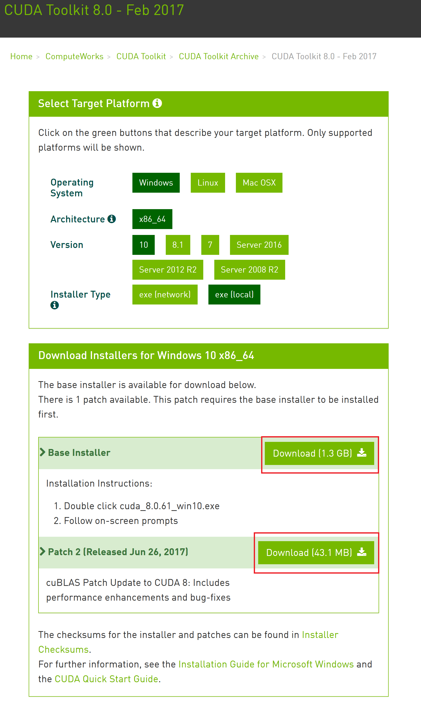
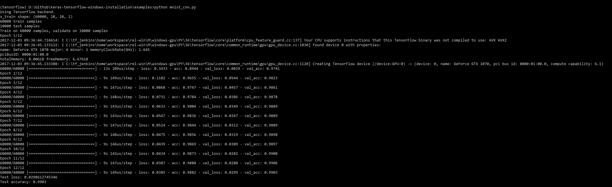

# Keras-TensorFlow-GPU-Windows-Installation
10 easy steps on the installation of TensorFlow-GPU and Keras in Windows 10 (Asus ROG GL502VS) 

From tensorflow site: https://www.tensorflow.org/install/install_windows requirements for current(1.4.0) version :
1. CUDA Toolkit 8.0
2. cuDNN v6.0 Library
3. Python 2.7/3.5/3.6 (We will use 3.6)

### Step 1: Install Anaconda [Python 3.6 version](https://repo.continuum.io/archive/Anaconda3-5.0.1-Windows-x86_64.exe)
 and follow the [installation steps](https://docs.anaconda.com/anaconda/install/windows)


### Step 2: Update Anaconda
Open Anaconda Prompt (can be found in start menu) to type the following command(s)
```Command Prompt
conda update conda
conda update --all
```

### Step 3: Install [CUDA Tookit 8.0](https://developer.nvidia.com/cuda-80-ga2-download-archive).
Choose your version depending on your Operating System.



### Step 4: Download [cuDNN](https://developer.nvidia.com/rdp/cudnn-download).
Choose your version depending on your Operating System.  
Membership registration is required.


Put your unzipped folder in C drive as follows: 
```Command Prompt
C:\cudnn-8.0-windows10-x64-v6.0
```
### Step 5: Add cuDNN into [Environment PATH](https://superuser.com/questions/949560/how-do-i-set-system-environment-variables-in-windows-10)
Add the following path in your Environment.  
Subjected to changes in your installation path.
```Command Prompt
C:\cudnn-8.0-windows10-x64-v6.0\cuda\bin
```

Turn off all the prompts. 
Open a new Anaconda Prompt to type the following command(s)
```Command Prompt
echo %PATH%
```
You shall see that the new Environment PATH is there.

### Step 6: Create an Anaconda environment with Python=3.6
Open Anaconda Prompt to type the following command(s)
```Command Prompt
conda create -n tensorflow python=3.6
```

### Step 7: Activate the environment and install some common package
Open Anaconda Prompt to type the following command(s)
```Command Prompt
activate tensorflow
pip install numpy scipy matplotlib spyder jupyter pandas pillow scikit-learn h5py
```

### Step 8: Install TensorFlow-GPU-1.4.0 (but the below command will install latest tensorflow)
Open Anaconda Prompt to type the following command(s)
```Command Prompt
pip install --ignore-installed --upgrade tensorflow-gpu
```

### Step 9: Install Keras
Open Anaconda Prompt to type the following command(s)
```Command Prompt
pip install keras
```

### Step 10: Testing
Let's try running [./examples/mnist_mlp.py](./examples/mnist_mlp.py)

Open Anaconda Prompt to type the following command(s)
```Command Prompt
activate tensorflow
python mnist_mlp.py
```


Let's try running [./examples/mnist_cnn.py](./examples/mnist_cnn.py)

Open Anaconda Prompt to type the following command(s)
```Command Prompt
activate tensorflow
python mnist_cnn.py
```




Congratulations ! You have successfully run Keras (with Tensorflow backend) over GPU on Windows !
